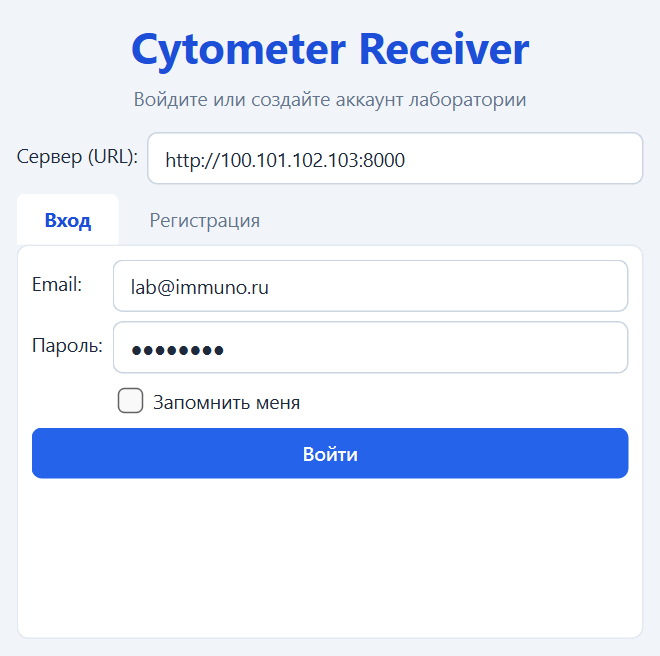
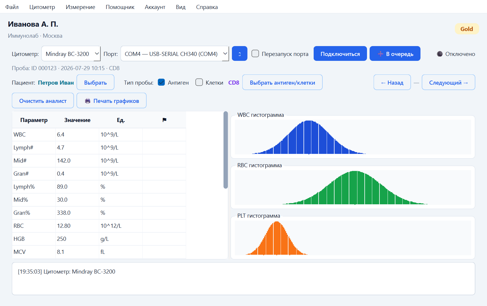

# Cytometer Receiver

Настольное приложение для приёма и обработки данных гематологических анализаторов
(Mindray BC‑3200, ABX Micros ES 60 и др.): параметры и гистограммы в реальном времени,
привязка проб к пациенту и антигену, очередь и обследования, ИИ‑помощник **Druck AI**.

## Скачать

Откройте **[Releases](../../releases)** и скачайте последнюю версию:

- **`CytometerReceiver.exe`** — основное приложение цитометра;
- **`DruckAI.exe`** — ИИ‑ассистент Druck AI (можно запускать отдельно).

Устанавливать ничего не нужно — всё необходимое уже внутри.

## Как пользоваться

**1. Запуск.** Запустите `CytometerReceiver.exe` **от имени администратора**
(правый клик → «Запуск от имени администратора») — права нужны для работы с COM‑портом.

**2. Вход.** Укажите адрес сервера лаборатории `http://<адрес>:8000`, ваш e‑mail и пароль.

**3. Работа.** Выберите цитометр и COM‑порт, нажмите **«Подключиться»**. Полученную пробу
привяжите к пациенту и антигену и добавьте **«➕ В очередь»**. Слева — параметры, справа —
гистограммы; кнопки «← Назад / Следующий →» листают недавние пробы пациента.

### Важные моменты

- Запускайте **от имени администратора** — иначе не работает перезапуск COM‑порта.
- Для анализаторов на адаптере **CH340** (Mindray) включите галочку **«Перезапуск порта»**
  (она запоминается) — тогда при подключении порт сбрасывается автоматически, и не нужно
  вручную выключать/включать его в Диспетчере устройств.
- Статус **🟡 connected** = порт открыт и данные идут. Зелёный «🟢 Подключено» —
  промежуточный; если он висит без данных, включите «Перезапуск порта».
- Смена цитометра при подключённом порте — порт перезапускается автоматически.

📖 **Полное руководство пользователя:**
[user_manual_v3.html](cytometer-receiver-user-manual/user_manual_v3.html) — вход, пациенты
и антигены, очередь, анализ и печать, аккаунт, решение частых ошибок — со скриншотами.

## Требования

Windows 10 / 11 (64‑бит) · 4 ГБ ОЗУ · свободный COM‑порт (драйвер **CH340** для Mindray) ·
права **администратора** · сеть до сервера лаборатории (порт **8000**).
